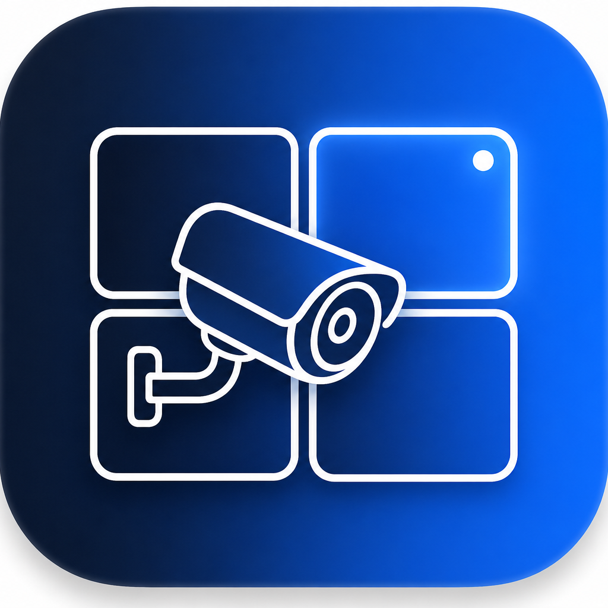

# UniFi Protect Viewer



A native **macOS** app that connects to a **UniFi Protect** controller and shows
your cameras in configurable grid views, with **Elgato Stream Deck** integration
to switch between views and pop individual cameras fullscreen.

- 🎥 Live multi-camera grid powered by the cameras' RTSP/RTSPS streams (VLCKit)
- 🧩 Multiple **configurable, named grid views** (pick cameras, ordering, layout, quality)
- ➕ **Custom streams** — add any RTSP/HTTP/HLS source (non‑UniFi cameras) alongside your Protect cameras
- 🖥️ Click any tile to go **fullscreen**; step through cameras with the keyboard
- 🎛️ **Stream Deck plugin** to switch views, pop a camera fullscreen, and step views
- 🔐 Password stored in the macOS **Keychain**; talks only to your local controller

> This project is not affiliated with or endorsed by Ubiquiti. It uses the
> unofficial UniFi Protect controller API and per-camera RTSP streams.

---

## Repository layout

```
.
├── project.yml                       # XcodeGen project definition
├── Sources/UnifiProtectViewer/       # macOS app (SwiftUI)
│   ├── App/                          # App entry + AppState
│   ├── Models/                       # Protect models, config, layouts
│   ├── Networking/                   # Protect API client + TLS trust
│   ├── Player/                       # VLCKit player + camera tile
│   ├── Views/                        # SwiftUI screens
│   ├── Control/                      # Local HTTP/WebSocket control server
│   ├── Persistence/                  # Config store + Keychain
│   └── Resources/                    # Info.plist, entitlements
├── streamdeck-plugin/                # Elgato Stream Deck plugin
│   └── com.unifiprotectviewer.sdPlugin/
└── docs/                             # Additional docs
```

---

## Building the macOS app

> For a step-by-step walkthrough (prerequisites, signing, troubleshooting), see
> **[docs/BUILDING.md](docs/BUILDING.md)**. Quick version below.

### Requirements

- macOS 13 (Ventura) or later
- Xcode 15+
- [XcodeGen](https://github.com/yonyz/XcodeGen) (`brew install xcodegen`)

The app depends on two Swift packages (resolved automatically by Xcode):

- **VLCKit** via [`tylerjonesio/vlckit-spm`](https://github.com/tylerjonesio/vlckit-spm) — RTSP/RTSPS playback
- **Swifter** via [`httpswift/swifter`](https://github.com/httpswift/swifter) — the local control server

### Generate & open

```bash
brew install xcodegen
xcodegen generate
open UnifiProtectViewer.xcodeproj
```

Then select the **UnifiProtectViewer** scheme and run (⌘R). On first launch Xcode
will resolve the Swift package dependencies (this can take a few minutes while
the VLCKit binary framework downloads).

> If you don't want to install XcodeGen, you can instead create a new macOS App
> project in Xcode, drag in `Sources/UnifiProtectViewer`, set the Info.plist and
> entitlements files, and add the two Swift packages listed above.

---

## Using the app

1. Launch the app, open **Settings** (⌘,) → **Connection**.
2. Enter your controller **host/IP**, a **local** UniFi Protect username and
   password.
   - A read-only Protect account is enough to view cameras.
   - To let the app **auto-enable RTSP**, the account needs admin rights.
     Otherwise enable RTSP manually per camera in UniFi Protect
     (*Camera → Settings → Advanced → RTSP*).
3. Choose default stream quality and whether to use RTSPS, then **Save & Connect**.
4. Your cameras load into the seeded **All Cameras** view.
5. Create more views with the **+** button in the sidebar; for each view choose a
   **layout**, pick/order **cameras**, and optionally override **quality**.
6. **Click** a tile to go fullscreen. Use **⌘←/⌘→** to switch views and **Esc**
   to leave fullscreen.

Configuration is saved to
`~/Library/Application Support/UnifiProtectViewer/config.json`
(the password lives in the Keychain, never on disk).

---

## Stream Deck integration

The app runs a small local **control server** (default `http://127.0.0.1:8723`)
that the Stream Deck plugin talks to. Configure it in **Settings → Stream Deck**.

> **Distributing to other Macs?** See **[docs/DISTRIBUTION.md](docs/DISTRIBUTION.md)**
> for building a signed/notarized Release `.app`/`.dmg`.

See **[docs/STREAMDECK.md](docs/STREAMDECK.md)** for installing the plugin and the
full HTTP/WebSocket API. In short:

- **Switch View** – jump to a specific grid view
- **Next View / Previous View** – cycle through views
- **Camera Fullscreen** – toggle a specific camera fullscreen
- **Exit Fullscreen** – return to the grid

Button titles auto-update to reflect the active view / fullscreen camera via the
control server's WebSocket.

---

## How streaming works

UniFi Protect cameras expose RTSP streams from the controller once RTSP is
enabled per channel:

- `rtsp://<controller>:7447/<rtspAlias>` (default)
- `rtsps://<controller>:7441/<rtspAlias>?enableSrtp` (encrypted, optional)

The app reads each camera's channels from the controller `bootstrap`, picks a
channel based on the requested quality (High/Medium/Low), and plays it with
VLCKit. Controllers use self-signed certificates, so HTTPS trust is pinned to the
host you configured (see `Networking/InsecureTrust.swift`).

---

## Security notes

- The password is stored only in the macOS Keychain.
- TLS validation is relaxed **only** for the exact controller host you configure.
- The control server binds locally; set an **auth token** in Settings if you want
  to require one (and enter the same token in the Stream Deck plugin).

---

## License

MIT. VLCKit is LGPLv2.1 (see its repository for details).
